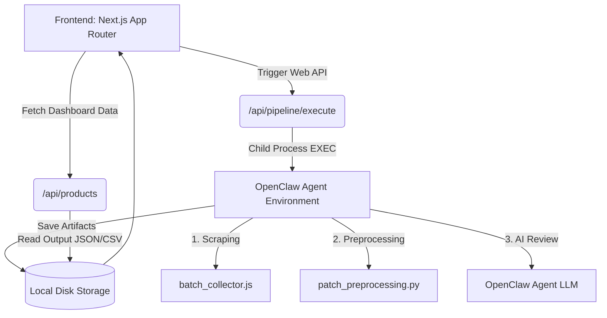

<div align="center">
  
  <h1>🛡️ Patch Review Dashboard Deep-Dive</h1>
  <p><strong>Next.js 15 App Router 기반 AI 패치 리뷰 마스터 대시보드</strong></p>

  <p>
    <a href="#overview">Overview</a> •
    <a href="#system-architecture">System Architecture</a> •
    <a href="#core-features">Core Features</a> •
    <a href="#directory-structure">Structure</a> •
    <a href="INSTALL.md">Installation Guide</a>
  </p>
</div>

---

## 🎯 Overview (개요)

`patch-review-dashboard`는 OpenClaw 에이전트 환경에서 구동되는 **Linux OS 보안 권고 및 패치 내역 웹 모니터링 대시보드**입니다. 
관리자는 이 대시보드를 통해 벤더사(Red Hat, Oracle, Ubuntu 등)로부터 수집된 수만 개의 패치 내역이 어떻게 전처리(Preprocessed)되고, AI 에이전트에 의해 어떻게 심층 리뷰(Reviewed)되는지 실시간으로 모니터링할 수 있습니다.
최종적으로 관리자가 개입하여 AI의 권고사항을 피드백하거나 수용함으로써 최종 패치 반영 리스트(Approved CSV)를 확정 짓게 됩니다.

## 🏗️ System Architecture (시스템 아키텍처)

이 프로젝트는 **Next.js 15 App Router**와 **React Server Components(RSC)**를 활용하여, 성능과 SEO, 그리고 클라이언트 사이드 상호작용의 균형을 맞추도록 설계되었습니다.



### 아키텍처 핵심 설계 사상
1. **Server-Side Data Hydration**: 파일 시스템(fs) 접근이 잦은 특성 상, Server-Side API 라우트(`route.ts`)와 비동기 Server Component(`page.tsx`)를 적극 활용하여 브라우저 로딩 타임을 최소화했습니다.
2. **Stateless UI Pattern**: `ClientPage.tsx` 패턴을 도입하여 다국어(`i18n.ts`) 렌더링 및 클라이언트 훅(`useState`, `useEffect`)이 필요한 부분만 별도 분리, Next.js의 "use client" 경계 충돌을 예방했습니다.
3. **Event-Driven AI Feedback Loop**: 관리자가 특정 패치 권고사항을 "제외(Exclude)" 처리하면, 그 사유가 JSON으로 기록되어 향후 AI 학습 프롬프트(`user_exclusion_feedback.json`)에 주입되는 **자가 피드백 루프**를 구축했습니다.

---

## ✨ Core Features (핵심 기능 분석)

### 1. 실시간 파이프라인 구동 및 추적
대시보드 화면상에서 "파이프라인 실행(Run Pipeline)" 버튼을 누르면 내부적으로 OpenClaw 백그라운드 프로세스가 실행됩니다.
- `/api/pipeline/execute`: 이 라우트에서 Node.js `child_process.spawn`이 발동하여 리눅스 환경의 스크래핑(JS) -> 전처리(Python) -> AI 리뷰(LLM) 단계의 스크립트들을 직렬로 순차 구동합니다.
- `/api/pipeline/status`: 실시간으로 `status.json`과 `debug.log` 파일 끝단을 추적하여 웹 대시보드 하단에 터미널 형태의 로그 콘솔을 뿌려줍니다.

### 2. 다국어 (i18n) 통합 지원 (English ⇄ Korean)
글로벌 엔지니어링 룰을 반영하기 위해 쿠키 기반의 i18n 환경을 구축했습니다.
- **쿠키 제어**: 헤더의 `LanguageToggle` 컴포넌트가 `NEXT_LOCALE` 쿠키를 `en` 혹은 `ko`로 변경 후 페이지 전체를 클라이언트 라우팅(루트 갱신)합니다.
- **`src/lib/i18n.ts` 딕셔너리 사전**: 하드코딩된 시스템 문구부터 오류 메시지, 서버 카드 라벨값("수집 완료", "AI 리뷰완료")까지 중앙화된 사전을 통해 모든 번역 관리가 일원화되어 있습니다.

### 3. AI 피드백 강제 주입 로직
단순한 뷰어(Viewer)를 넘어선 **AI 학습 인터페이스**입니다.
- AI가 `Critical`로 평가한 패치라도, 현업 관리자가 "방화벽 우회 처리 완료(Compensating Control Exists)" 사유로 제외 버튼을 누를 수 있습니다.
- 관리자가 제출한 사유와 카테고리는 `/api/pipeline/feedback`을 통해 즉시 파일로 구워지며, 다음 파이프라인 시작 시 LLM의 System Prompt 인젝션에 "절대 이 항목은 추가하지 말 것"이란 지침과 함께 전송됩니다.

### 4. 마스터 리뷰 마감 및 산출물(CSV) 도출
모든 리뷰가 끝나면 "마스터 리뷰 마감(DONE)" 버튼을 통해 결과 데이터를 확정짓습니다.
- `/api/pipeline/finalize`: 사용자가 화면에서 승인/제외한 상태 배열만 수합하여 원본을 PapaParse 라이브러리로 필터링합니다. 필터링이 완료된 정보만 `final_approved_patches_redhat.csv` 형태로 저장됩니다.
- **데이터 아카이빙**: 새로운 파이프라인이 다시 구동되면, 오염 방지를 위해 이 과거의 승인 산출물과 로그 파일들은 전부 타임스탬프 형태의 `/archive/` 폴더로 영구 백업 및 초기화됩니다.

---

## 📂 Repository Code Structure

```text
patch-review-dashboard/
├── src/
│   ├── app/
│   │   ├── api/pipeline/               # 백엔드 API 컨트롤러 (execute, finalize, export, feedback)
│   │   ├── category/                   # OS 세분화 동적 라우팅 페이지
│   │   │   ├── [categoryId]/
│   │   │   │   ├── archive/            # 과거 리뷰 데이터 아카이브 기록망 열람 레이지 로딩
│   │   │   │   └── [productId]/        # (ex. redhat, ubuntu) 제품별 상세 스코어 파싱 컴포넌트
│   │   ├── globals.css                 # 
│   │   └── layout.tsx                  # 최상단 글로벌 레이아웃 (LanguageToggle 등 주입)
│   ├── components/                     # 재사용 가능한 UI 모듈 (PremiumCard, ProductGrid)
│   └── lib/
│       └── i18n.ts                     # 언어 번역 딕셔너리 매핑 레지스트리
```

> [!TIP]
> **OpenClaw 기반 완전 신규 구축 (설치 및 셋업 가이드)**가 필요하다면, 함께 동봉된 [INSTALL.md](INSTALL.md) 파일을 읽어주십시오!

<div align="center">
  <br>
  <p><i>Google Antigravity - CITEC Architecture</i></p>
</div>
