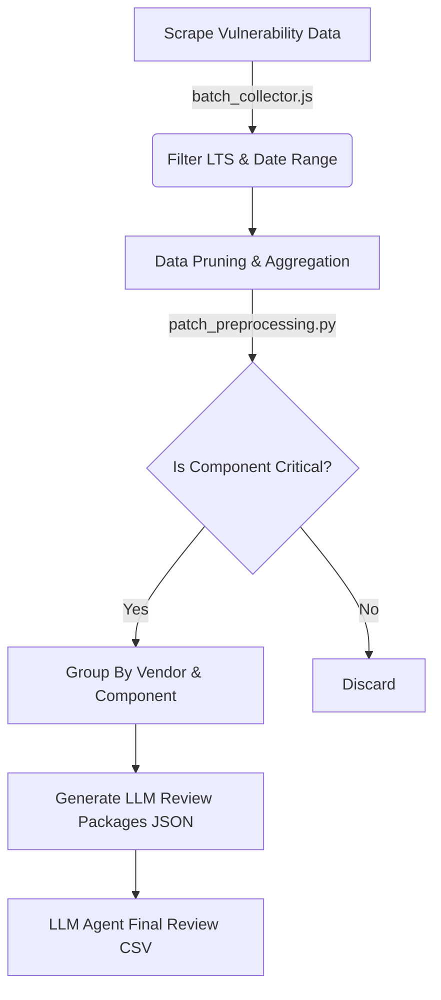

<div align="center">
  
  <h1>🛡️ Patch Review Agent Skill</h1>
  <p><strong>Automated Linux Security Advisory & Patch Review Pipeline</strong></p>

  <p>
    <a href="#features">Features</a> •
    <a href="#supported-platforms">Supported Platforms</a> •
    <a href="#workflow">Workflow</a> •
    <a href="#installation">Installation</a>
  </p>
</div>

---

## 🎯 Overview

The **Patch Review** skill automates the monotonous yet critical task of inspecting Linux security errata and updates. Built for the OpenClaw agent ecosystem, it scrapes advisories from major vendors, processes and prunes them according to strict system impact heuristics, and leverages cutting-edge LLMs to simulate a tier-3 system administrator review.

## ✨ Features

- **Multi-Vendor Data Pipelines**: Concurrently aggregates advisories from Red Hat, Ubuntu, and Oracle Linux.
- **Heuristic Pruning**: Intelligent filtering of packages. Focuses explicitly on system-critical components that could cause *System Hang*, *Data Loss*, *Boot Failure*, or *Privilege Escalation*.
- **Oracle Linux Integration**: Complete parity with RHEL. Evaluates both the Unbreakable Enterprise Kernel (UEK) and crucial base system packages (e.g. `systemd`, `glibc`, `lvm2`).
- **Cumulative History Tracking**: Builds historical context for recurring patch attempts, ensuring the AI agent analyzes prior failures.
- **Agentic Analysis Engine**: Provides pre-structured prompts and context so that an LLM can simulate a precise human-level impact review.

## 🐧 Supported Platforms

| OS | Scraping Method | Target Packages Reviewed |
| :--- | :--- | :--- |
| **Ubuntu LTS** | Web Pagination | Active LTS releases (`22.04 LTS`, `24.04 LTS`) |
| **Red Hat (RHEL)** | Customer Portal Search | Strict Core Whitelist (Kernel, Storage, Network, Security) |
| **Oracle Linux** | Errata Mailing List | UEK & **Full System Core Packages** |

---

## 📈 Workflow Structure



## 🚀 Installation & Deployment

This skill is designed to run natively on the **tom26** (`citec@172.16.10.237`) server within the OpenClaw Agent workspace.

```bash
# Directory Structure on tom26
cd ~/.openclaw/workspace/skills/patch-review

# Install NodeJS dependencies
npm install

# 1. Fetch Advisories (Last 90 days)
node os/linux/batch_collector.js --days 90

# 2. Prune and Prepare Data
python3 os/linux/patch_preprocessing.py

# 3. Simulate Agent Review
python3 os/linux/perform_actual_review.py
```

<div align="center">
  <br>
  <p><i>Property of Google Antigravity & CITEC. Documented for the openclaw ecosystem.</i></p>
</div>
